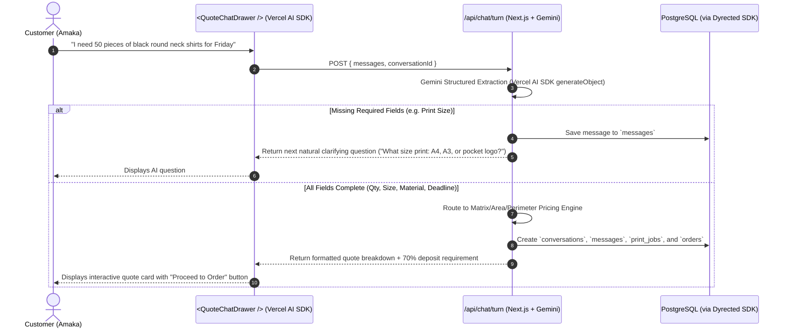

# Public-Facing Pages & Frontend Architecture Specification

**Project:** PrintOS  
**Target Audience:** Prospective print customers (Amaka) and Shop Operators (Chidi)  
**Technology Stack:** Next.js 16 (App Router), Tailwind CSS v4, **shadcn UI**, **Vercel AI SDK** (`ai` + `@ai-sdk/google`), Dyrected SDK (`@dyrected/sdk`), and PostgreSQL.  
**Companion Documents:** `specs/PRD.md`, `specs/tech-architecture.md`, `specs/pricing-engine.md`, `AGENTS.md`

---

## 1. Overview & Visual Design System

The public storefront balances the speed of modern digital commerce with the practical realities of Nigerian print manufacturing (bespoke specifications, material proofing, 70% production deposits).

```text
┌─────────────────────────────────────────────────────────────────────────────┐
│                          PrintOS Public Frontend                            │
├──────────────────────────────────────┬──────────────────────────────────────┤
│ 1. Landing & Service Showcase (/)    │ • Hero + dual CTAs                   │
│                                      │ • 10 Catalog Services Grid           │
│                                      │ • Turnaround & 70% Deposit Badges    │
├──────────────────────────────────────┼──────────────────────────────────────┤
│ 2. Conversational AI Chat Drawer     │ • Powered by Vercel AI SDK           │
│    (<QuoteChatDrawer />)             │ • Multi-turn Gemini spec extraction  │
│                                      │ • Zero math required from customer   │
├──────────────────────────────────────┼──────────────────────────────────────┤
│ 3. Interactive Quote Calculator      │ • Visual Matrix/Area/Perimeter tool  │
│    (/quote)                          │ • Instant price & deposit breakdown  │
├──────────────────────────────────────┼──────────────────────────────────────┤
│ 4. Shareable Order Receipt           │ • Itemized specs + 70% deposit due   │
│    (/quote/[orderNumber])            │ • Bank payment details & proofing    │
└──────────────────────────────────────┴──────────────────────────────────────┘
```

### Design System Tokens (Amber Gold & Deep Lapis Obsidian)
Aligned with `specs/tech-architecture.md` (Section 8.C):

| Role | Token Name | Hex / CSS Value | Application |
| :--- | :--- | :--- | :--- |
| **Primary Brand Accent** | `color-brand-amber` | `#F59E0B` (`hsl(38, 92%, 50%)`) | Primary CTAs, active filter pills, price range sliders, key highlights |
| **Primary Dark / Hover Glow** | `color-brand-amber-dark` | `#D97706` (`hsl(38, 92%, 40%)`) | Button hover states, glowing border outlines, badge rings |
| **Secondary Accent** | `color-accent-lapis` | `#3B82F6` (`hsl(217, 91%, 60%)`) | Telegram bot pills, customer quote drawer header, secondary buttons |
| **Secondary Dark** | `color-accent-lapis-dark` | `#1E40AF` (`hsl(224, 76%, 40%)`) | Subdued pills, channel badges, backdrop depth |
| **Dark Canvas (Obsidian Base)** | `color-obsidian` | `#0B0E14` & `#111827` | Storefront background canvas, sleek minimal navigation |
| **Card Surface Dark** | `color-card-dark` | `#161E2E` (`hsl(222, 36%, 14%)`) | Glassmorphic product cards with subtle amber/slate rim lighting |
| **High-Contrast Editorial Banner** | `color-editorial-amber` | `#F59E0B` with `#0B0E14` text | Bold statement/trust block (70% deposit & turnaround rules) |
| **Light Mockup Canvas** | `color-surface` | `#F8FAFC` & `#FFFFFF` | Clean framed product inner canvas for crisp merch display |
| **Healthy Status / Deposit Paid** | `color-success` | `#10B981` | Margin $\ge 30\%$, Paid Deposits, Verified Badges |
| **At-Risk / Deadline Warning** | `color-warning` | `#F59E0B` | Expiring Quotes, Pending Deposit Reminders |
| **Loss-Making / Debt Alert** | `color-danger` | `#EF4444` | Urgent alerts, underquote safeguards |

---

## 2. Page 1: Landing Page & Service Capability Showcase (`src/app/page.tsx`)

### Layout & Component Architecture (Editorial Print-House Inspiration)

```text
┌─────────────────────────────────────────────────────────────────────────────────────────┐
│ [PrintOS Seal]   Capabilities   Visual Calculator   Telegram Bot        [⚡ AI Quote]   │
├─────────────────────────────────────────────────────────────────────────────────────────┤
│ 🏆 HERO SECTION:                                                                        │
│ "Precision Print Quotes in Seconds — Powered by Intelligent Operations."                │
│ Plain-language intake, zero print jargon required, instant 70% deposit breakdown.       │
│ [⚡ Get Instant AI Quote]             [💬 Order on Telegram]                             │
├─────────────────────────────────────────────────────────────────────────────────────────┤
│ 🖨️ SERVICE CAPABILITY SHOWCASE                                                           │
│ Category Filter Tabs: [ ALL (10) ] [ APPAREL (4) ] [ SIGNAGE (3) ] [ PAPER (2) ] [ ART ]│
│                                                                                         │
│ ┌────────────────────────┐ ┌────────────────────────┐ ┌────────────────────────┐        │
│ │  [ DTF Shirt Mockup  ] │ │  [ Roll-Up Stand Mock ]│ │  [ Flex Banner Mockup ]│        │
│ │  APPAREL & MERCH       │ │  LARGE FORMAT & SIGNAGE│ │  LARGE FORMAT & SIGNAGE│        │
│ │  DTF Custom T-Shirts   │ │  Roll-Up Banner Stand  │ │  Outdoor Flex Banner   │        │
│ │  From ₦4,500 / piece   │ │  From ₦32,000 / piece  │ │  From ₦850 / sqft      │        │
│ │  ⏱️ 24–48h Turnaround   │ │  ⏱️ 24h Turnaround     │ │  ⏱️ Same-Day Ready     │        │
│ │  [⚡ AI Quote] [Telegram│ │  [⚡ AI Quote] [Telegram│ │  [⚡ AI Quote] [Telegram│        │
│ └────────────────────────┘ └────────────────────────┘ └────────────────────────┘        │
├─────────────────────────────────────────────────────────────────────────────────────────┤
│ ⚡ HIGH-CONTRAST EDITORIAL TRUST BANNER (Amber Gold Card, Obsidian Text):               │
│ "70% deposit gets your work rolling immediately. No hidden math. 24–48h express delivery."│
└─────────────────────────────────────────────────────────────────────────────────────────┘
```

### Key Components (Built with shadcn UI):
1. **Header & Navigation (`<Header />`):**
   * Circular retro/modern PrintOS brand mark.
   * Navigation links: *Capabilities*, *Interactive Calculator (`/quote`)*, *Telegram Bot*.
   * Quick-launch CTA button: **"Get Instant AI Quote"** (opens `<QuoteChatDrawer />` with glowing amber pulse indicator).
2. **Hero Section (`<HeroSection />`):**
   * Headline: *"Precision Print Quotes in Seconds — Powered by Intelligent Operations."*
   * Subtitle: *"Upload your specs or chat in plain Nigerian business terms. Get instant, mathematically guaranteed quotes with zero back-and-forth."*
   * Dual Launch CTAs:
     * `<Button>`: **"Get Instant AI Quote"** (launches `<QuoteChatDrawer />`).
     * `<Button variant="outline">`: **"Order on Telegram"** (deep-links to `@PrintOSBot`).
3. **Category Filter Tabs (`<CategoryTabs />`):**
   * Filter pills for fast exploration: `All Capabilities`, `Apparel & Merch`, `Large Format & Signage`, `Stationery & Paper`, `Framing & Wall Art`.
   * Active state with warm Amber Gold pill styling (`#F59E0B`).
4. **Framed Service Showcase Grid (`<ServiceGrid />` & `<ServiceCard />`):**
   * Displays the 10 catalog print services from PostgreSQL (`services`):
     * *Apparel & Merch:* DTF Printed T-Shirts, Screen Printing, Corporate Polo Embroidery, Custom Mugs.
     * *Large Format & Signage:* Flex Banners (Outdoor), Roll-up Banners, SAV Vinyl Stickers.
     * *Stationery & Paper:* A5 Flyers, Premium Business Cards.
     * *Framing & Wall Art:* Picture Framing & Canvas Wraps.
   * Clean mockup gallery container (crisp presentation on hangers, stands, or mockups) inside dark obsidian card surfaces (`#161E2E`).
   * Tracked uppercase category badges (e.g. `APPAREL & MERCH`), bold titles, starting benchmark rates (e.g. `From ₦4,500 / piece` or `From ₦850 / sqft`), and turnaround badge (`⏱️ 24–48h`).
   * Dual Action CTAs: `Instant Quote` (opens AI Drawer pre-seeded with service context) and `Telegram` (Bot link with pre-filled command).
5. **High-Contrast Editorial Trust Banner (`<TrustBanners />`):**
   * Bold Amber Gold block (`#F59E0B`) with high-contrast Obsidian text (`#0B0E14`).
   * Emphasizes the **70% Production Deposit Standard** and **24–48h express delivery** in plain Nigerian business terms (`AGENTS.md` compliant).
   * Playful vector line-art character accents providing creative studio charm.

---

## 3. Page 2: Conversational AI Chat Widget / Drawer (`<QuoteChatDrawer />`)

### Vercel AI SDK Integration Architecture:
The chat widget provides an effortless, conversational intake experience for customers who don't know print jargon.



### Implementation Details:
* **Client:** Uses `useChat` from `ai/react` or custom SSE streaming hook.
* **Server (`/api/chat/turn`):**
  * Uses `generateObject` or `streamText` from `ai` with `@ai-sdk/google` (`gemini-2.5-flash`).
  * Enforces `ExtractedConversationSpec` schema with Zod.
  * Writes directly to `conversations`, `messages`, `print_jobs`, and `orders` via `@dyrected/sdk`.
* **Plain Language Compliance (`AGENTS.md`):**
  * Outputs *"Money you'll make"*, *"Deposit (70%)"*, *"Balance due upon pickup (30%)"*.

---

## 4. Page 3: Interactive Quote Calculator (`src/app/quote/page.tsx`)

*For operators and customers who prefer a structured, visual price calculator over chat.*

### Components & Flow:
1. **Engine-Aware Input Form:**
   * **For Matrix Items (T-Shirts, Flyers, Cards):**
     * Quantity slider / input with volume tier discount badges (`1-20`, `21-100`, `101+`).
     * Size selector (`Pocket Logo`, `A4 Front`, `A3 Front/Back`).
   * **For Area Items (Banners, Vinyl Stickers):**
     * Width (ft) $\times$ Height (ft) inputs with live square footage calculation.
     * Material substrate selection (Flex 440gsm, SAV Gloss, SAV Matte).
   * **For Perimeter Items (Photo Frames, Canvas):**
     * Width (in) $\times$ Height (in) inputs with live perimeter inches calculation.
     * Frame moulding style selection.
2. **Real-Time Financial Breakdown Card:**
   * **Total Price:** e.g. `₦175,000`
   * **70% Deposit Required:** e.g. `₦122,500`
   * **30% Balance Due:** e.g. `₦52,500`
   * Action: **"Lock in Quote & Attach Artwork"** (creates Order record and generates receipt link).

---

## 5. Page 4: Shareable Order & Quote Receipt (`src/app/quote/[orderNumber]/page.tsx`)

*The permanent, mobile-optimized URL sent to customers via WhatsApp or SMS to review and settle their deposit.*

### Key Sections:
1. **Order Header:** Reference number (e.g. `ORD-2026-0042`), date created, and current fulfillment status badge (`Draft Quote`, `Deposit Paid`, `In Production`, `Completed`).
2. **Itemized Job Table:** Specifications, print dimensions, substrates, and unit breakdowns.
3. **Deposit & Settlement Summary:**
   * Customer will pay: `₦275,000`
   * Initial Deposit (70%): `₦192,500`
   * Balance upon delivery (30%): `₦82,500`
4. **Bank Transfer Settlement Instructions:**
   * Bank Name, Account Number, Account Name (e.g. *PrintOS Production Hub / Moniepoint*).
   * Quick copy-to-clipboard buttons.
5. **Artwork Proofing & File Upload (`<ArtworkDropzone />`):**
   * Upload artwork directly to Cloudinary via the `Assets` collection (`/api/dyrected/api/collections/assets`).

---

## 6. Frontend File Structure

```text
src/
├── app/
│   ├── layout.tsx                     # Root layout with fonts & theme provider
│   ├── page.tsx                       # Landing page & service catalog showcase
│   ├── globals.css                    # Tailwind CSS v4 & theme variables
│   ├── quote/
│   │   ├── page.tsx                   # Interactive visual quote calculator
│   │   └── [orderNumber]/
│   │       └── page.tsx               # Shareable customer quote & order receipt
│   └── api/
│       ├── chat/
│       │   └── turn/
│       │       └── route.ts           # Vercel AI SDK multi-turn conversational intake
│       └── webhooks/
│           └── telegram/
│               └── route.ts           # Telegram Bot webhook handler
├── components/
│   ├── ui/                            # shadcn UI components (Button, Card, Dialog, Tabs, etc.)
│   ├── storefront/
│   │   ├── Header.tsx                 # Navigation bar with quick quote CTA
│   │   ├── HeroSection.tsx            # High-conversion hero banner
│   │   ├── CategoryTabs.tsx           # Category filter pills for capabilities
│   │   ├── ServiceCard.tsx            # Capability card with benchmark rates & dual CTAs
│   │   ├── ServiceGrid.tsx            # Responsive capability showcase grid
│   │   └── TrustBanners.tsx           # 70% deposit policy & express turnaround
│   ├── chat/
│   │   ├── QuoteChatDrawer.tsx        # Slide-over chat widget using Vercel AI SDK
│   │   ├── ChatMessageList.tsx        # Message bubble stream
│   │   ├── ChatInput.tsx              # Input with audio/voice & fast pill suggestions
│   │   └── LiveQuoteCard.tsx          # Real-time extracted quote summary inside chat
│   └── calculator/
│       ├── MatrixCalculator.tsx       # Volume tiered calculator
│       ├── AreaCalculator.tsx         # 2D surface sqft calculator
│       └── PerimeterCalculator.tsx    # 1D linear framing calculator
└── lib/
    ├── ai/
    │   ├── gemini.ts                  # Vercel AI SDK Google provider setup
    │   └── extraction-schema.ts       # Zod schemas for conversational specs
    ├── pricing-engine.ts              # Deterministic calculation functions
    └── utils.ts                       # Formatting & currency utilities (₦ NGN)
```

---

## 7. Package Dependencies Required

To support this frontend architecture, the following packages are integrated:
* `ai` (Vercel AI SDK core)
* `@ai-sdk/google` (Google Gemini 2.5 Flash provider)
* `zod` (Structured schema validation)
* `lucide-react` (Icons)
* `class-variance-authority`, `clsx`, `tailwind-merge` (shadcn UI primitives)
