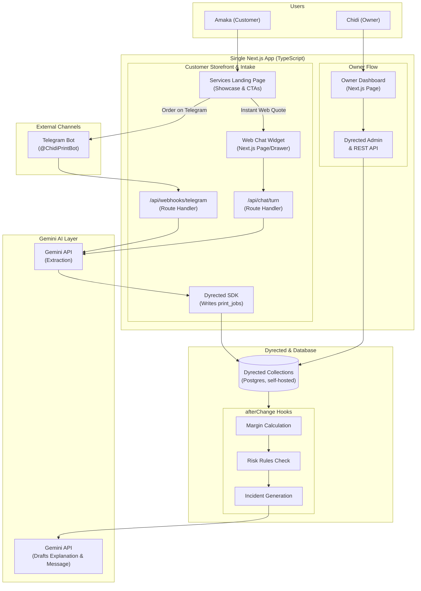

# Technical Architecture
## Job Profitability Guardian — built on Next.js + Dyrected

**Companion doc to:** `PRD.md`
**Stack constraint:** TypeScript, Next.js, Dyrected (self-hosted, embedded) — verified against docs.dyrected.com
**Build window:** 3 days

---

## 1. System overview

One Next.js application, in TypeScript, contains everything: the customer-facing storefront / services showcase and quote chat, the owner-facing dashboard, and — embedded inside the same app — Dyrected as the backend. Customers can browse print services (Banners, Custom Merch, Corporate Print, Packaging) on the landing page and request an instant quote either via the embedded **Web Chat Widget** or directly through the **Telegram Bot**.

Dyrected owns the database schema, the auto-generated REST API, the admin panel, and the owner's login. Gemini does three distinct jobs: turning a customer's free-text conversation into a structured job spec, computing a plain-English explanation and recommended action once a risk is detected, and generating the weekly report. The margin and risk math itself is deterministic code, not an LLM call — more on why in Section 6.



**Why self-hosted Dyrected, not Dyrected Cloud:** this was a real decision, not a default. Dyrected's own docs frame the choice as "does the CMS need to run inside your product backend, or just serve content to it?" This project needs three things Dyrected Cloud explicitly does not support: custom server endpoints (the chat turn API, the Telegram webhook), arbitrary TypeScript hooks with external API calls (calling Gemini when a job is created or a material price changes), and application-user authentication for the owner login. All three are exactly what self-hosted Dyrected is for. Self-hosted also means the whole thing — UI, API routes, and Dyrected core — deploys as a single Next.js app, which matters a lot for a 3-day build.

---

## 2. Stack summary

| Layer | Tool | Why |
| :--- | :--- | :--- |
| Frontend + backend | Next.js (TypeScript), single app | One codebase, one deploy target |
| Backend/data layer | Dyrected, self-hosted, embedded via `@dyrected/next` | Schema, auto REST API, admin panel, and auth come free — no hand-rolled backend |
| Database | Postgres (via `@dyrected/db-postgres` adapter) | Dyrected's recommended adapter; any managed Postgres (Neon, Railway) works |
| AI | Gemini | Structured extraction, risk explanation, message drafting, weekly report |
| Owner auth | Dyrected `auth: true` collection | Built-in login/JWT for the dashboard, no custom auth code |
| Telegram Bot (secondary channel) | Telegram Bot API (webhook) | Proves the architecture generalizes past the demo; zero-setup instant messaging channel |
| Hosting | Vercel or Railway (single Next.js deployment) | Self-hosted Dyrected ships inside the app, so there's nothing to deploy separately |

---

## 3. Dyrected data model (collections)

All of this lives in `dyrected.config.ts`, typed, as the single source of truth for schema, admin UI, and the generated API. Collection names follow `snake_case`, while all collection fields and schema properties use `camelCase`. Each collection is organized in its own file under `src/dyrected/collections/`.

### `customers` (Customer CRM & Debt Ledger)

Represents the recurring customer entity to track order history, lifetime spend, and outstanding balances across all intake channels.

| Field | Type | Notes |
| :--- | :--- | :--- |
| `name` | text | Full name (e.g. "Amaka Eze") |
| `phone` | text | Phone number (WhatsApp / primary identifier) |
| `email` | text | Optional email |
| `company` | text | Company / Brand name |
| `telegramHandle` | text | Telegram username |
| `totalSpent` | number | Lifetime money paid to shop (₦) |
| `outstandingDebt` | number | Total balance customer still owes (₦) |
| `notes` | text | Customer preferences / trust notes |

### `conversations`

Represents the customer interaction session containing one or more requested print jobs.

| Field | Type | Notes |
| :--- | :--- | :--- |
| `customer` | relationship → `customers` | Linked customer record |
| `channel` | select: `webChat` / `telegram` / `manual` | Intake channel |
| `status` | select: `inProgress` / `completed` / `abandoned` | Conversation lifecycle |
| `customerName` | text | Customer's name (cached) |
| `customerContact` | text | Phone number or handle |

### `orders` (The Commercial Order Container)

Represents the overall order grouping multiple line items with commercial payment tracking.

| Field | Type | Notes |
|---|---|---|
| `orderNumber` | text | Unique identifier (e.g. "ORD-2026-0042") |
| `conversation` | relationship → `conversations` | Source chat session |
| `customerName` | text | Customer name |
| `customerContact` | text | Customer phone/email |
| `subtotal` | number | Sum of all child `print_jobs.quotedPrice` |
| `depositRequired` | number | Calculated deposit benchmark (e.g. 70%) |
| `depositPaid` | number | Recorded deposit received |
| `balanceDue` | number | Computed as `subtotal − depositPaid` |
| `balanceDueDate` | date | Payment deadline for the remaining balance |
| `paymentStatus` | select: `unpaid` / `depositPaid` / `fullyPaid` / `overdue` | Commercial payment state |
| `status` | select: `quoted` / `confirmed` / `inProduction` / `completed` / `cancelled` | Order fulfillment lifecycle |

### `services` (The Service & Pricing Engine Registry)

Defines the physical print methods and which pricing engine algorithm calculates their cost and retail price.

| Field | Type | Notes |
|---|---|---|
| `name` | text | e.g. "DTF T-Shirt", "Flex Banner", "A5 Flyers", "Photo Framing" |
| `category` | select: `largeFormat` / `apparel` / `stationery` / `packaging` / `framing` | Storefront & routing category |
| `pricingEngine` | select: `matrix` / `area` / `perimeter` / `flatRate` | Quoting algorithm selector |
| `defaultMaterial` | relationship → `materials` | Default cost benchmark linked |
| `baseBlankCost` | number | Optional base cost (e.g. ₦3,500 for blank t-shirt, ₦18,000 for roll-up stand) |
| `unit` | select: `piece` / `sqft` / `sqm` / `inch` / `pack` | Dimensional or count unit |
| `imageUrl` | text | Path to showcase image asset |
| `isActive` | boolean | Toggle storefront visibility |

### `pricing_rules` (The Rate Grids & Constants)

Stores the tier matrices and area/linear rates used by the pricing engines.

| Field | Type | Notes |
|---|---|---|
| `service` | relationship → `services` | Service this rule applies to |
| `sizeArea` | text | For Matrix Engine: "A4", "A3", "Pocket", "Single", "Double" |
| `minQuantity` | number | Quantity bracket start (e.g. 1, 21, 101, 500) |
| `maxQuantity` | number | Quantity bracket end (optional, null for unbound) |
| `unitPrice` | number | For Matrix Engine: Price per unit for this size/tier |
| `ratePerUnitArea` | number | For Area Engine: Rate per sqft or sqm (e.g. ₦800/sqft) |
| `ratePerLinearUnit` | number | For Perimeter Engine: Rate per inch/cm (e.g. ₦150/inch) |
| `targetMarginPercent` | number | Desired margin benchmark (e.g. 40%) |

### `print_jobs`

Represents an individual quoted print line item belonging to an order ($1 : N$ relationship).

| Field | Type | Notes |
|---|---|---|
| `order` | relationship → `orders` | Parent commercial order this job belongs to |
| `conversation` | relationship → `conversations` | Originating chat session |
| `service` | relationship → `services` | Linked service category/engine |
| `item` | text | e.g. "3ft Roll-up Banner" |
| `quantity` | number | e.g. 2 |
| `width` | number | Optional dimension for Area/Perimeter engine |
| `height` | number | Optional dimension for Area/Perimeter engine |
| `material` | relationship → `materials` | Drives the cost lookup |
| `spec` | text | Finish/spec description (e.g. "Matte lam", "Front A3 print") |
| `quotedPrice` | number | Quoted price for this line item |
| `materialCost` | number | **Computed by hook**, not entered manually |
| `marginPercent` | number | **Computed by hook** |
| `marginStatus` | select: `healthy` / `atRisk` / `lossMaking` | **Computed by hook** |
| `status` | select: `quoted` / `inProduction` / `completed` / `cancelled` | Production state |
| `sourceChannel` | select: `webChat` / `telegram` / `manual` | Intake channel |

### `materials` (the cost benchmark table)

| Field | Type | Notes |
|---|---|---|
| `name` | text | e.g. "250gsm art card", "Flex Banner Roll (440gsm)" |
| `unitCost` | number | Seeded from the dataset's material-price signals |
| `unit` | text | per sheet / per sqm / per sqft / per roll |
| `lastUpdated` | date | Updating this triggers cascade re-scoring in US-7 |

### `incidents`

| Field | Type | Notes |
|---|---|---|
| `printJob` | relationship → `print_jobs` | Flagged print job |
| `type` | select: `underquote` / `materialPriceSpike` / `reprint` / `overdueBalance` | Risk type |
| `financialImpact` | number | ₦ exposure, used for prioritisation |
| `urgencyScore` | number | `financialImpact × inverse time-to-deadline` |
| `reason` | text | **Gemini-generated**, plain-English explanation |
| `recommendedAction` | text | **Gemini-generated** |
| `draftedMessage` | text | **Gemini-generated**, ready to send |
| `status` | select: `open` / `resolved` | Resolution state |
| `resolutionNote` | text | Optional resolution note |

### `messages`

| Field | Type | Notes |
|---|---|---|
| `conversation` | relationship → `conversations` | Thread this message belongs to |
| `role` | select: `customer` / `assistant` | Message sender |
| `content` | text | Raw message text |
| `timestamp` | date | Message time |

### `owners`
Dyrected's collection-level `auth: true` turns this into a full auth provider — login endpoints, JWT issuance, and dashboard access control come from the framework, not custom code. This is the one collection that needs `auth: true`; every other collection above is plain data.

---

## 4. API surface

**Free from Dyrected (zero custom code):**
- Full CRUD REST endpoints under `/api` for every collection above — this is what the owner dashboard reads from and what the admin panel uses.
- Login/session endpoints for the `owners` collection.
- The Dyrected admin UI itself, generated from the config — useful as an instant internal tool for seeding `materials` benchmark data without building a settings screen.

**Custom Next.js API routes (only where self-hosted Dyrected earns its keep):**

| Route | Method | Purpose |
| :--- | :--- | :--- |
| `/api/chat/turn` | `POST` | Receives one message from the web chat widget, holds multi-turn extraction logic with Gemini structured output, writes to `conversations`/`messages`/`print_jobs` via the Dyrected SDK, returns the next question or final quote |
| `/api/webhooks/telegram` | `POST` | Telegram Bot webhook target with secret token validation — reuses the exact same extraction pipeline and SDK writes as web chat, returning messages via Telegram Bot API |
| `/api/cron/check-overdue` | `GET` | Scheduled watchdog route (secured with `CRON_SECRET`) that evaluates time-based risks (overdue balances, deadline urgency decay) and creates incident records |
| `/api/reports/weekly` | `POST` | Aggregates `print_jobs` + `incidents` via the SDK, calls Gemini to summarise financial health, returns markdown report (triggered via button or cron) |

Everything else — reading the job list, updating a material's cost, marking an incident resolved — goes straight through Dyrected's generated REST API via `@dyrected/sdk`, no custom route needed.

---

## 5. The two flows, step by step

### Flow A — Amaka's quote conversation

1. Customer sends a message in the web chat widget (or taps a pre-filled service CTA).
2. `/api/chat/turn` loads (or creates) the `conversations` session + prior `messages` via the SDK.
3. Gemini is called with the conversation history and structured extraction schema to (a) extract an array of requested print jobs and customer contact info, and (b) formulate the next clarifying question if required fields are missing.
4. If fields are incomplete: the assistant's follow-up question is saved as a `messages` record and returned to the widget. Repeat from step 1.
5. If fields are complete: the Quoting Engine routes each job through its corresponding pricing engine (Matrix, Area, or Perimeter) to compute the deterministic `quotedPrice`. One or more `print_jobs` records are created via the SDK tied to the `conversation` (`sourceChannel: 'webChat'`). Each job write triggers the `print_jobs` collection's `afterChange` hook synchronously.
6. The computed `quotedPrice` totals and itemized breakdown flow back into the chat response as the final quote shown to Amaka. She never sees margin or risk data — only the prices.

### Flow B — Chidi's dashboard & risk engine

1. A `print_jobs.afterChange` function hook fires on every create/update. It looks up the related `material.unitCost`, computes `materialCost = quantity × unitCost`, computes `marginPercent`, and sets `marginStatus` against configurable thresholds. This is plain TypeScript math — no LLM call.
2. If `marginStatus` crosses into `atRisk` or `lossMaking`, the same hook creates an `incidents` record with `type`, `financialImpact`, and `urgencyScore` already computed.
3. The new `incidents` document's own `afterChange` hook — which self-hosted Dyrected guarantees runs with a writable database adapter — calls Gemini once to generate `reason`, `recommendedAction`, and `draftedMessage` in one pass, then writes them back onto the same incident record.
4. A `materials.afterChange` hook (fires when a shop owner updates a unit cost) re-runs step 1 for every open `print_job` referencing that material — this is what makes US-4/US-7 ("recalculate automatically when a price changes") real instead of a per-job manual trigger.
5. A daily cron job (`/api/cron/check-overdue`) scans for unpaid balances past `balanceDueDate` and generates `overdueBalance` incidents.
6. The dashboard reads `print_jobs` and `incidents` straight from the Dyrected REST API — no polling logic needed beyond a normal client-side fetch/refetch.

---

## 6. AI integration & deterministic math specifications

### A. Gemini Structured Extraction Schema

`/api/chat/turn` and `/api/webhooks/telegram` invoke Gemini with structured JSON output enforcing this schema (multi-item support with camelCase properties):

```typescript
export interface ExtractedPrintJobSpec {
  item?: string;               // e.g. "3ft Roll-up Banner", "DTF T-Shirt"
  serviceCategory?: string;    // "largeFormat" | "apparel" | "stationery" | "packaging" | "framing"
  quantity?: number;           // e.g. 2
  width?: number;              // For Area/Perimeter (e.g. 3)
  height?: number;             // For Area/Perimeter (e.g. 7)
  dimensionUnit?: string;      // "ft" | "m" | "inch" | "cm"
  sizeArea?: string;           // For Matrix (e.g. "A4", "A3", "Pocket", "Single", "Double")
  materialName?: string;       // e.g. "250gsm art card", "Flex Banner"
  spec?: string;               // e.g. "Matte lamination"
  targetDeadline?: string;     // ISO Date string
  quotedPrice?: number;        // Explicit price if mentioned by customer/log
  depositAmount?: number;      // Deposit if discussed
}

export interface ExtractedConversationSpec {
  customerName?: string;       // e.g. "Amaka"
  customerContact?: string;    // Phone number or email
  jobs: ExtractedPrintJobSpec[]; // Array of print jobs in this conversation
  isComplete: boolean;         // True only if all items have required fields known
  nextQuestion?: string;       // Natural clarifying question if isComplete is false
}
```

### B. The 3 Quoting Engines (Summary)

*For full mathematical proofs, code implementations, and seed datasets, see the dedicated [Pricing Engine Specification](file:///Users/busola/Work/print-os/specs/pricing-engine.md).*

When `quotedPrice` is not pre-set by an explicit quote, the backend routes the job through one of three deterministic pricing engines linked via `services.pricingEngine`:

1. **Size / Quantity Matrix Engine** (Apparel, DTF, Flyers, Cards, Mugs):
   $$\text{quotedPrice} = \text{quantity} \times \left( \text{baseBlankCost} + \text{pricingRule.unitPrice}(\text{sizeArea}, \text{quantityTier}) \right)$$
2. **Area Calculator Engine** (Flex Banners, SAV Stickers, Large Posters):
   $$\text{quotedPrice} = \text{quantity} \times \left( (\text{width} \times \text{height}) \times \text{pricingRule.ratePerUnitArea} + \text{baseBlankCost} \right)$$
3. **Perimeter Calculator Engine** (Photo Framing, Canvas Stretchers):
   $$\text{quotedPrice} = \text{quantity} \times \left( \left[ (\text{width} + \text{height}) \times 2 \right] \times \text{pricingRule.ratePerLinearUnit} + \text{baseBlankCost} \right)$$

### C. Margin & Incident Risk Formulas

All margin arithmetic and incident prioritization formulas are strictly calculated in TypeScript:

1. **Material Cost:**
   $$\text{materialCost} = \text{quantity} \times \text{material.unitCost}$$

2. **Gross Margin %:**
   $$\text{marginPercent} = \left( \frac{\text{quotedPrice} - \text{materialCost}}{\text{quotedPrice}} \right) \times 100$$

3. **Margin Status Thresholds:**
   - $\text{marginPercent} \ge 30\%$ $\longrightarrow$ `healthy` (Green)
   - $10\% \le \text{marginPercent} < 30\%$ $\longrightarrow$ `atRisk` (Amber)
   - $\text{marginPercent} < 10\%$ $\longrightarrow$ `lossMaking` (Red)

4. **Incident Urgency Scoring:**
   $$\text{urgencyScore} = \text{financialImpact (₦)} \times \left( \frac{1}{\max(1, \text{daysUntilDeadline})} \right)$$

---

## 7. Telegram Bot channel & security

`/api/webhooks/telegram` receives updates from Telegram Bot API with the following structure:
- **Security:** Verified using the `X-Telegram-Bot-Api-Secret-Token` header to ensure incoming requests originate from Telegram.
- **Session Mapping:** Telegram `chat.id` maps to `conversations.channel = 'telegram'` and a unique external session reference.
- **Unified Logic:** The message text passes to the exact same extraction service that powers web chat. When `isComplete: false`, the assistant responds with `nextQuestion`. When `isComplete: true`, the SDK creates the `print_jobs` records attached to the conversation, triggers hooks, and responds with the formatted itemized quote via Telegram `sendMessage`.

---

## 8. Frontend structure & UI component hierarchy

The frontend is built inside Next.js (App Router) with clean separation between the public storefront and the owner's operations portal:

```text
src/
├── app/
│   ├── page.tsx                      # Public Storefront & Services Showcase
│   ├── (auth)/login/page.tsx         # Owner Login (Dyrected JWT Auth)
│   ├── dashboard/
│   │   ├── page.tsx                  # Owner Operations Dashboard (Executive Overview & Live Feed)
│   │   ├── pricing/page.tsx          # Interactive Matrix & Area Pricing Grid Editor
│   │   └── incidents/page.tsx        # Prioritized Incident Log & Escalation Queue
│   ├── admin/[[...dyrected]]/        # Embedded Dyrected Admin Panel
│   └── api/
│       ├── chat/turn/route.ts        # Conversational extraction route
│       ├── webhooks/telegram/route.ts# Telegram bot handler
│       ├── cron/check-overdue/route.ts # Daily risk evaluation watchdog
│       └── reports/weekly/route.ts   # Weekly summary report generator
├── components/
│   ├── ui/                           # shadcn UI Primitives (Base-UI / Tailwind v4)
│   │   ├── button.tsx, card.tsx, badge.tsx
│   │   ├── dialog.tsx, table.tsx, input.tsx, tabs.tsx
│   ├── storefront/
│   │   ├── ServicesShowcase.tsx      # Print services grid with dual CTAs
│   │   ├── ServiceCard.tsx           # Individual card (Banners, Merch, etc.) with image assets
│   │   └── ChatWidget.tsx            # Floating / drawer web quote chat
│   └── dashboard/
│       ├── KPISummary.tsx            # 4 Executive KPI Cards (Margin %, ₦ at Risk, Debt, Alerts)
│       ├── CollectionMetrics.tsx     # Drilldown cards (Orders, Jobs, Materials, Incidents)
│       ├── PricingMatrixGrid.tsx     # Visual spreadsheet-style matrix rate editor
│       ├── JobsTable.tsx             # Real-time margin %, status pills, order group links
│       ├── IncidentQueue.tsx         # Scored incident cards + drafted actions
│       └── QuickLogModal.tsx         # Pasted WhatsApp / raw text parser
```

### A. Executive Dashboard Metrics (Top-Level Pulse Check)

Chidi's dashboard header prominently displays 4 **Guardian KPI Cards**:

| KPI Card | Display Value | Target Benchmark | Business Significance |
| :--- | :--- | :--- | :--- |
| **Net Active Margin %** | `38.2%` | $> 30\%$ (Healthy) | Real-time blended profitability across active production |
| **Total ₦ at Risk** | `₦185,000` | `₦0` | Total Naira exposure across underquoted or price-spiked jobs |
| **Overdue Client Debt** | `₦320,000` | `₦0` | Outstanding balance debt past delivery deadline (`balanceDueDate`) |
| **Active Incidents** | `4 Open Alerts` | Sorted by `urgencyScore` | Immediate risk items with pre-drafted 1-click customer messages |

### B. Per-Collection Metrics Drilldown

- **`orders`**: Total Active Orders in pipeline, % with 70% deposit secured, Average Order Value (AOV).
- **`print_jobs`**: Total jobs on floor, Margin Distribution Pills (`18 Healthy` | `3 At-Risk` | `1 Loss-Making`), Square footage / pieces volume.
- **`incidents`**: Open vs Resolved ratio, Root Cause Distribution (Material Spikes vs Underquotes vs Debt), Top Urgent Item Countdown.
- **`materials`**: Active cost benchmarks, volatile materials alert with $>10\%$ price increase in last 14 days.
- **`conversations`**: Daily inquiry count (Web Chat vs Telegram), quote-to-order conversion rate.

### C. Design System & Vibrant Color Palette

The interface uses an elevated, luxury fintech-grade aesthetic ("Amber Gold & Deep Lapis Obsidian") tailored for high-margin print operations:

| Role | Token Name | Value | Usage |
| :--- | :--- | :--- | :--- |
| **Primary Brand** | `color-brand-amber` | `#F59E0B` (`hsl(38, 92%, 50%)`) | Primary CTAs, metallic brand accents, active states, key metric highlights |
| **Primary Dark / Border Glow** | `color-brand-amber-dark` | `#D97706` (`hsl(38, 92%, 40%)`) | Button hover states, glowing border outlines, badge rings |
| **Secondary Accent** | `color-accent-lapis` | `#3B82F6` (`hsl(217, 91%, 60%)`) | Telegram bot pills, customer quote drawer, secondary buttons |
| **Secondary Dark** | `color-accent-lapis-dark` | `#1E40AF` (`hsl(224, 76%, 40%)`) | Subdued pills, chat widget headers, channel badges |
| **Dark Base (Obsidian)** | `color-obsidian` | `#0B0E14` & `#111827` | Dark mode canvas, sidebars, headers with warm ambient glow |
| **Card Surface** | `color-card-dark` | `#161E2E` (`hsl(222, 36%, 14%)`) | Glassmorphic cards with amber rim lighting |
| **Light Canvas** | `color-surface` | `#F8FAFC` & `#FFFFFF` | Dashboard card backgrounds, clean text readability |
| **Healthy Margin** | `color-success` | `#10B981` | Margin $\ge 30\%$, Paid Deposits, Healthy Status pills |
| **At-Risk Margin** | `color-warning` | `#F59E0B` | Margin $10\% - 30\%$, Expiring Deadlines |
| **Loss-Making / Debt** | `color-danger` | `#EF4444` | Margin $< 10\%$, Overdue Incidents, Underquote alerts |

---

## 9. Environments, hosting, and secrets

- **One deployment target.** Because Dyrected is embedded (`@dyrected/next`), the whole app — storefront, chat widget, dashboard, API routes, Dyrected core, admin panel — ships as one Next.js deployment.
- **Database:** Postgres via `@dyrected/db-postgres` (Neon or Railway managed Postgres).
- **Secrets (`.env`):**
  - `DATABASE_URL`: Postgres connection string
  - `GEMINI_API_KEY`: Google Gemini API key for extraction and drafting
  - `TELEGRAM_BOT_TOKEN`: Telegram bot token from BotFather
  - `TELEGRAM_BOT_SECRET_TOKEN`: Secret header token for webhook verification
  - `CRON_SECRET`: Bearer token for securing `/api/cron/check-overdue`
  - `DYRECTED_SECRET`: Encryption key for Dyrected authentication sessions

---

## 10. Edge cases & guardrails

### A. Conversational & AI Extraction Guardrails

| Scenario | Edge Case | Mitigation / Handler |
| :--- | :--- | :--- |
| **Vague Quantity or Specs** | Customer says *"I need some banners"* or *"make it big"*. | Gemini structured output marks `isComplete: false` and returns `nextQuestion`: *"How many banners do you need, and what size (e.g., 3x6 ft)?"* |
| **Mid-Conversation Correction** | Customer says 200 flyers, then later says *"actually, make that 500"*. | Gemini receives full conversation history and updates `quantity` for that item before issuing the final quote. |
| **Unrecognized Material** | Customer specifies a non-standard material (e.g. *"fancy textured gold card"*). | Fuzzy-match to the closest benchmark material (e.g., "Art Card 300gsm") or leave `material: null` for owner review. |
| **Off-Topic / Chit-Chat** | Customer sends unrelated banter or greetings. | Gemini returns `isComplete: false` with a polite redirect back to print specifications. |
| **Multiple Items in One Message** | Customer requests banners and flyers in the same prompt. | Gemini returns `jobs: [ { item: "Banner", ... }, { item: "Flyers", ... } ]` in the array. |

### B. Business Logic & Math Guardrails

| Scenario | Edge Case | Mitigation / Handler |
| :--- | :--- | :--- |
| **Zero or Missing Quoted Price** | `quotedPrice: 0` or negative number. | Guard against division-by-zero: if `quotedPrice <= 0`, force `marginPercent: 0` and flag as `lossMaking`. |
| **Deposit Exceeds Total Price** | `depositAmount > quotedPrice`. | Clamp `balanceDue = Math.max(0, quotedPrice - depositAmount)` to prevent negative debt. |
| **Missing / Undefined Deadline** | Customer does not specify a target completion date. | Default `daysUntilDeadline` to standard 7 days in the urgency formula: $\max(1, \text{daysUntilDeadline})$. |
| **Severe Loss-Making Job** | Material cost exceeds quoted price (e.g., ₦30k cost vs ₦20k quote). | `marginPercent` evaluates negative (e.g., $-50\%$), immediately creating an `underquote` incident. |

### C. Hooks, Concurrency & Webhook Guardrails

| Scenario | Edge Case | Mitigation / Handler |
| :--- | :--- | :--- |
| **Telegram Webhook Retries** | Telegram retries webhooks if the response takes $>5\text{s}$. | Webhook route responds with HTTP 200 promptly or deduplicates by Telegram `update_id`. |
| **Duplicate Incident Creation** | Repeated saves on a job shouldn't create duplicate identical open incidents. | `incidents` creation hook checks if an open incident of the same `type` already exists for that `printJob`. |
| **Cascade Loop Prevention** | Updating material costs re-scores jobs without triggering cyclical hooks. | Unidirectional triggers (`materials.afterChange` $\rightarrow$ updates `print_jobs`, without triggering back-updates). |
| **Cron Job Idempotency** | `/api/cron/check-overdue` runs repeatedly throughout the day. | Only logs an `overdueBalance` incident if no unresolved overdue incident exists for that job. |

---

## 11. Build sequencing for 3 days

1. **Scaffold Dyrected into the Next.js app; define all collections** (`conversations`, `print_jobs`, `services`, `pricing_rules`, `materials`, `incidents`, `messages`) plus `owners` with `auth: true`. Everything downstream reads or writes to this schema, so it goes first.
2. **Seed `materials`, `services`, and `pricing_rules`** with benchmark costs and rates derived from the dataset and `teylod-backend` playbooks, directly through the auto-generated Dyrected admin panel — no custom seeding UI needed.
3. **Write the 3 Quoting Engines (Matrix, Area, Perimeter)** and the `print_jobs.afterChange` margin/risk hook + `materials.afterChange` cascade hook. This is the deterministic core from Section 6 — get it right before adding any AI on top, since it's the part that must never be wrong in the demo.
4. **Build `/api/chat/turn` and the chat widget UI**, wired to the Gemini structured extraction prompt and quoting engines. This is Amaka's whole experience and the highest-risk piece to leave late.
5. **Build the public storefront landing page** with the service cards and dual quote CTAs.
6. **Write the `incidents.afterChange` hook** that calls Gemini for `reason`/`recommendedAction`/`draftedMessage`.
7. **Build the owner dashboard**: KPI cards, job list with margin/status, incident queue sorted by `urgencyScore`, Quick-Log pasted chat modal, resolve action.
8. **Add `/api/cron/check-overdue` and `/api/reports/weekly`** with on-demand trigger buttons.
9. **Rehearse the demo path end to end** as a judge would experience it: open the chat, play Amaka, watch a seeded material-price change or reprint push a job into `atRisk` live on the dashboard, open the incident, show the drafted message.
10. **If time remains:** wire `/api/webhooks/telegram` and a Telegram Bot token as the multi-channel proof point described in Section 7.